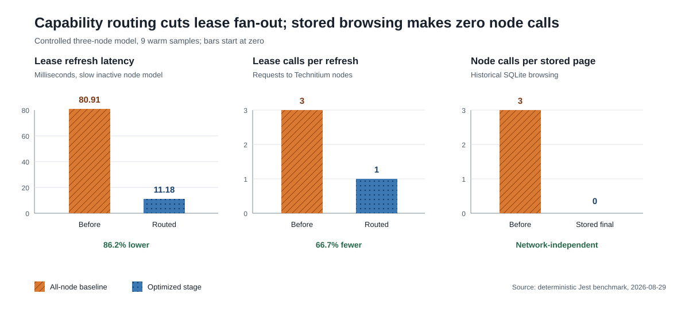
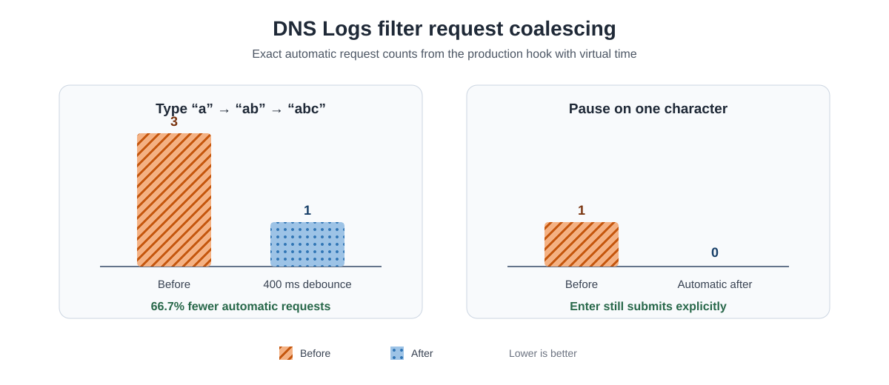

# DHCP Capability Discovery and Stored-Log Isolation

## Outcome

DNS Logs stored browsing no longer contacts live Technitium nodes for DHCP hostname enrichment. Background hostname collection discovers which nodes have enabled DHCP scopes and requests leases only from those nodes.

In this report, **Before** means the behavior shipped in Companion v1.10.1 and
earlier. Capability routing and stored isolation are successive optimization
stages released together in Companion v1.11.0.



| Measurement | v1.10.1 baseline | v1.11.0 capability routing | v1.11.0 stored isolation |
| --- | ---: | ---: | ---: |
| Controlled slow-node median | 80.91 ms | 11.18 ms | — |
| Lease calls per refresh | 3 | 1 | — |
| Live-node calls per stored page | 3 | 1 before isolation | 0 |
| Existing-name enrichment, 50 rows | 81.20 ms | 11.18 ms | 0.001 ms |

Capability routing reduced the controlled refresh latency by 86.2% and lease fan-out by 66.7%. Stored isolation removes the network dependency entirely; the remaining cached transformation is CPU-local and below normal request-timing resolution.

Raw measurements are available in [dhcp-capability-benchmark-results.csv](./dhcp-capability-benchmark-results.csv).

## Why both changes are necessary

The previous hostname path called `/api/dhcp/leases/list` on every configured node. It did this even when all returned SQLite rows already contained persisted client names. Interactive requests did not share the 30-second background lease cache, so an unavailable non-DHCP node could delay a stored-page response until the 30-second backend request timeout; the browser abandons DNS Logs requests after 25 seconds.

Capability discovery fixes background and live enrichment fan-out:

1. Every five minutes, the background path requests `/api/dhcp/scopes/list` from nodes whose capability state is stale.
2. A node is a lease candidate only when at least one returned scope has `enabled: true`.
3. `/api/dhcp/leases/list` is requested only from candidate nodes.
4. Returned leases are filtered to the discovered enabled-scope names.
5. Concurrent refreshes share one discovery promise.
6. A failed discovery retains last-known-good capability and retries after 30 seconds. A never-classified background node is skipped until discovery succeeds.
7. Companion DHCP scope mutations invalidate the affected capability and lease caches immediately.

Stored isolation fixes the request boundary: stored endpoints use the hostname persisted at ingestion plus in-memory DHCP/PTR caches. They never initiate Technitium requests. Live Tail mode retains live enrichment.

Technitium documents `enabled` on `/api/dhcp/scopes/list`; lease results from `/api/dhcp/leases/list` include the owning `scope`. The API does not expose a documented per-scope lease-list endpoint. See the [Technitium DNS Server API documentation](https://github.com/TechnitiumSoftware/DnsServer/blob/master/APIDOCS.md).

## Controlled method

The opt-in Jest benchmark uses a deterministic three-node topology:

- one active DHCP node: 10 ms modeled response
- one healthy inactive node: 10 ms modeled response
- one slow inactive node: 80 ms modeled response
- 50 stored rows whose client names are already persisted
- 9 samples per stage; stored cached-only timing uses 1,000 iterations per sample

The all-node baseline models the removed production behavior with `Promise.all()`. The capability and cached-only stages execute the production `TechnitiumService` methods. Wall time is the warm median; request counts are exact.

The controlled delay is intentionally small so the benchmark remains fast and deterministic. It demonstrates fan-out and critical-path behavior, not an estimate of internet or VPN latency.

## Anonymized deployment observations

A secret-safe read-only probe confirmed that the anonymous deployment contained both DHCP-capable and inactive nodes. Node identities, topology counts, scope counts, lease counts, and client-address counts are intentionally omitted.

| Observation | Result |
| --- | ---: |
| Active-node scope-list time | 128 ms |
| Active-node lease-list time | 111 ms |
| Inactive-node scope-list range | 64–106 ms |
| Inactive-node lease-list range | 53–110 ms |

Capability routing changes each lease refresh from one request per configured node to requests only for active candidates. In this healthy snapshot, the active node was also the slowest lease responder; parallel wall time therefore remained near 111 ms even though requests and empty responses fell. The latency benefit becomes material when an inactive node is slow or unreachable.

Most retained rows already had a persisted hostname. Background ingestion and PTR resolution continue backfilling unresolved clients.

## Production timing instrumentation

Uncached combined stored requests now log these server-side stages:

- counts
- row selection
- JSON parsing plus cached hostname enrichment
- per-node summary counts
- total service time

Requests taking at least 100 ms are logged at normal level; faster requests use debug level. This makes post-deployment measurements attributable without including domains, client addresses, tokens, or other query contents.

## Production-test verification

The validated working tree was deployed to an anonymized production-test environment on 2026-08-29. The public health endpoint returned `status: ok`, and startup discovery identified the DHCP-capable subset, matching the independent pre-change probe. No inactive-node DHCP lease failure was observed during startup.

An authenticated DNS Logs session produced the following backend measurements:

| Request class | Samples | Observed total | Important stage result |
| --- | ---: | ---: | --- |
| Live combined | 7 | 181.27–258.73 ms | Network fetch was 90.0–94.8% of total |
| Stored, unfiltered deduplication | 2 | 1,459.90–1,460.34 ms | Selection was about 1,005 ms |
| Stored, all observed requests | 15 | 579.99–8,226.10 ms | Median 1,085.77 ms |
| Cached hostname enrichment | 15 | 0.52–0.81 ms | No live-node calls |

The browser console reported failed loads while the client filter changed through one-character prefixes. These were superseded requests canceled by the frontend, not backend errors or the 25-second timeout: every corresponding backend request completed within 8.23 seconds, and no request error was logged. Because `node:sqlite` executes synchronously, aborting the browser fetch does not cancel SQL already running on the server.

The broad-prefix effect was measurable in the deployed FTS index: shorter prefixes produced substantially larger candidate sets. The exact private filter values and cardinalities are intentionally omitted. The two roughly eight-second samples immediately followed one-character requests; this association is an inference from request order, while the backend stage timings are direct measurements.

This confirms the isolation objective: hostname enrichment is no longer material to stored-page latency. The remaining bottleneck is filtered deduplication over broad FTS result sets, amplified by starting a server query on every keystroke.

## Filter interaction iteration

The next iteration reduces abandoned synchronous SQL without changing the query itself. Paginated domain and client filters now wait for 400 ms of inactivity before changing the server query. A one-character client/hostname filter does not run automatically; the UI explains that Enter submits it explicitly. Clicking a domain or client remains an explicit action and applies immediately. Tail mode retains immediate client-side filtering without restarting its network request for each keystroke.



| Controlled interaction | v1.10.1 behavior | v1.11.0 behavior | Change |
| --- | ---: | ---: | ---: |
| Type `a` → `ab` → `abc`, 100 ms apart | 3 requests | 1 request (`abc`) | 66.7% fewer |
| Pause on `a` | 1 automatic request | 0 automatic requests | 100% fewer |
| Press Enter on `a` | 1 explicit request | 1 explicit request | Preserved |

The deterministic benchmark uses virtual time and executes the production React hook. It measures request generation rather than wall-clock rendering. Raw results are in [logs-filter-interaction-results.csv](./logs-filter-interaction-results.csv).

This coalescing prevents a common typing sequence from starting the broadest one-character query at all. It does not make an explicitly requested broad prefix faster; filtered deduplication remains a separate SQL optimization target.

## Reproduction

Run from `apps/backend`:

```bash
RUN_DHCP_CAPABILITY_BENCHMARKS=true \
  npx jest src/technitium/dhcp-capability.bench.spec.ts \
  --runInBand --no-coverage
```

The benchmark is skipped during normal test runs.

Run the interaction benchmark from `apps/frontend`:

```bash
RUN_LOG_FILTER_BENCHMARKS=true \
  npx vitest run src/test/logs-filter-interaction.bench.spec.tsx \
  --reporter=verbose
```

This benchmark is also skipped during normal test runs.
