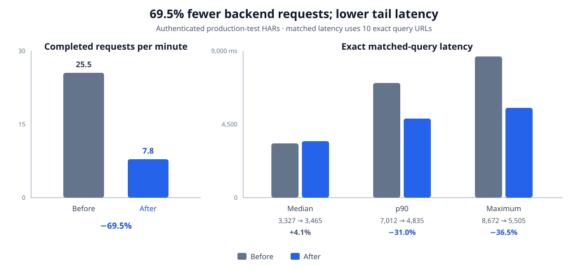

# DNS Logs Browser Request Control

## Outcome

Production-derived browser evidence showed that request cancellation, pagination, and refresh behavior amplified the remaining SQLite query cost. This iteration makes query-log fetches bypass the PWA runtime cache, blocks page navigation while a request is active, and pauses automatic refresh when entering Paginated mode.

In this report, **Before** means the browser behavior shipped in Companion
v1.10.1 and earlier. **After** means the request-control behavior released in
Companion v1.11.0.




| Controlled interaction | v1.10.1 behavior | v1.11.0 behavior | Change |
| --- | ---: | ---: | ---: |
| Cancelled stored-log requests routed through Workbox | 10 | 0 | 100% removed |
| Five rapid page selections admitted | 5 | 1 | 80% fewer |
| Automatic refreshes during 30 seconds in Paginated mode | 10 | 0 | 100% fewer |

These measurements quantify request admission, not SQLite execution speed. They remove overlapping and abandoned work so subsequent database timings represent one requested operation rather than a queue of competing operations.

Raw measurements are available in [dns-logs-browser-request-results.csv](./dns-logs-browser-request-results.csv).

## Production HAR baseline (v1.10.1 behavior)

The v1.10.1-behavior capture came from a production-test build backed by an anonymized deployment database. The capture observed 101 seconds of Combined Stored browsing with 200 rows per page and domain-plus-client deduplication enabled. It included filter changes, automatic refreshes, and navigation through deep pages.

| HAR measurement | v1.10.1 baseline |
| --- | ---: |
| Browser stored-log fetches | 43 |
| Completed network fetches | 43 |
| Browser-cancelled fetches | 10 |
| Cancelled fetches still completed by Workbox | 10 |
| Completed request median | 1,462 ms |
| Completed request p90 | 6,446 ms |
| Completed request maximum | 16,532 ms |
| HTTP errors | 0 |

Chrome recorded the page-to-service-worker fetch and Workbox-to-network fetch separately. The analysis pairs those records so they are not incorrectly counted as duplicate backend calls. All ten browser cancellations still had a matching Workbox request that completed against the backend.

The deepest requests overlapped. Pages 9 through 13 started within about one second; their durations ranged from 3,596 to 16,532 ms. Two requests spent about six seconds establishing a connection, including TLS, while synchronous SQLite work was active. This is evidence of request pile-up and event-loop starvation, not a single 16-second SQL execution.

## Production-test v1.11.0 capture

The accepted v1.11.0 capture observed 154 seconds against the same anonymized deployment database, with 200 rows and domain-plus-client deduplication. The analyzer identified direct browser routing and zero Workbox network fetches.

| Live measurement | v1.10.1 behavior | v1.11.0 behavior | Change |
| --- | ---: | ---: | ---: |
| Completed backend requests per minute | 25.5 | 7.8 | 69.5% fewer |
| Browser fetches per minute | 25.5 | 9.4 | 63.4% fewer |
| Cancelled requests that continued to the backend | 10 | 0 | 100% removed |
| All completed requests: median | 1,462 ms | 2,207 ms | 51.0% higher |
| All completed requests: p90 | 6,446 ms | 4,325 ms | 32.9% lower |
| All completed requests: maximum | 16,532 ms | 5,505 ms | 66.7% lower |
| HTTP errors | 0 | 0 | unchanged |

The overall median mixes different request populations. The v1.10.1-behavior capture contained 17 repeated requests and 14 sub-100 ms responses; the v1.11.0 capture contained no repeated exact queries and no sub-100 ms responses. The higher overall median therefore must not be interpreted as a like-for-like SQL regression.

For a closer latency comparison, the analysis matched the ten exact query URLs present in both captures. This holds page number, row count, sort, deduplication, and filter values constant. Each URL is represented by its median when repeated within a capture.

| Ten matched exact queries | v1.10.1 behavior | v1.11.0 behavior | Change |
| --- | ---: | ---: | ---: |
| Median of query medians | 3,327 ms | 3,465 ms | 4.1% higher |
| p90 of query medians | 7,012 ms | 4,835 ms | 31.0% lower |
| Maximum query median | 8,672 ms | 5,505 ms | 36.5% lower |

The matched median is effectively flat for this small production sample, while the upper tail improved materially. The dominant user-visible gain is less queueing: the backend handled 69.5% fewer completed requests per minute and no cancelled browser request continued through Workbox.

## Cumulative changes

### 1. Abortable PWA routing

Query-log data endpoints no longer match Workbox's `NetworkFirst` API route. The browser sends them directly, preserving `AbortController` cancellation instead of allowing Workbox to continue a superseded request. Storage status and unrelated APIs retain their existing caching behavior.

### 2. Serialized page navigation

Prev, Next, and page-jump controls are disabled for both initial `loading` and subsequent `refreshing` states. Previously they were disabled only for the initial load, so repeated navigation could start multiple synchronous SQLite queries.

### 3. Paginated refresh policy

Switching from Live Tail to Paginated mode now pauses the three-second refresh timer. Users can explicitly resume it, but historical browsing no longer inherits high-frequency polling from Tail mode.

## Reproduction

The repository includes a secret-safe HAR analyzer. It reports aggregate request counts and timings without emitting request URLs, filter values, headers, or response bodies:

```bash
node apps/frontend/scripts/analyze-logs-har.mjs /path/to/capture.har
```

Pass the v1.10.1-behavior baseline and v1.11.0 HARs together to reproduce the normalized request rates and privacy-safe exact-query latency comparison:

```bash
node apps/frontend/scripts/analyze-logs-har.mjs \
  /path/to/before.har \
  /path/to/after.har
```

Run the controlled interaction benchmark from `apps/frontend`:

```bash
RUN_LOG_FILTER_BENCHMARKS=true \
  npx vitest run src/test/logs-filter-interaction.bench.spec.tsx \
  --reporter=verbose
```

The benchmark executes the production routing and request-admission policies. The production HAR remains private because it contains DNS-log response bodies and internal identifiers; only anonymized aggregates are committed.

### Comparable live v1.11.0 capture

Use the deployed production-test build and the same authenticated browser profile as the baseline:

1. Reload the application once and confirm the new service worker has activated.
2. Open DevTools **Network**, clear existing entries, and start recording.
3. Open **DNS Logs → Combined Stored**, select 200 rows, and enable domain-plus-client deduplication.
4. Apply the same client filter used for the baseline, switch to Paginated mode, and navigate through the same deep-page sequence.
5. Leave Paginated mode open for at least 30 seconds, then export **HAR with content**.
6. Run the analyzer above and add only its aggregate output to this document and CSV.

The browser profile matters because Companion API requests require an authenticated session. Do not commit the HAR or session material.

The first attempted v1.11.0 capture was rejected before comparison because the analyzer reported `routing: "service-worker"`; its open tab still used the previous application generation. After unregistering the old service worker and reopening the application, the accepted v1.11.0 capture reported `routing: "direct"`. Rejected measurements are not included in the result tables.

## Validation boundary

The controlled benchmark proves the request-admission policies deterministically, and the authenticated HAR confirms them in production-test. The exact build was verified healthy and its generated service worker contains the query-log bypass route.

The two HAR windows differ in duration and the database continued receiving DNS logs between captures. Request rates are normalized per minute, and the exact-query latency subset reduces workload-shape differences, but ten matched queries are not enough to claim a precise median SQL speedup. The evidence supports a strong reduction in request amplification and tail latency, with approximately unchanged matched median latency.
