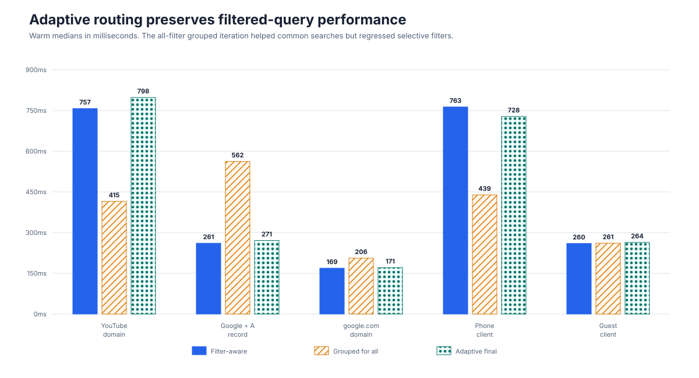

# Query Log SQLite Performance Iterations

## Outcome

The final adaptive query path removes four multi-second SQLite hotspots on the DNS Logs page without slowing normal page-one browsing or selective filtered searches.

The baseline models the query path shipped in Companion v1.10.1 and earlier.
The final column is the optimized path released in Companion v1.11.0.


| DNS Logs operation | v1.10.1 baseline warm median | v1.11.0 warm median | Reduction |
| --- | ---: | ---: | ---: |
| Unfiltered domain dedup | 2,980 ms | 136 ms | 95.4% |
| Deep domain-dedup page (offset 2,500) | 2,920 ms | 145 ms | 95.0% |
| Unfiltered per-client dedup | 3,250 ms | 196 ms | 94.0% |
| Unique-domain count | 1,680 ms | 5 ms | 99.7% |
| Blocked-entry count | 1,300 ms | 2 ms | 99.8% |
| One-hour domain dedup | 37 ms | 36 ms | No material change |
| Ordinary page one, dedup off | 0.03 ms | 0.03 ms | No change |

The full measured dataset is available in [query-log-sqlite-benchmark-results.csv](./query-log-sqlite-benchmark-results.csv).

## Method

The opt-in Jest benchmark generated one deterministic database and reused that identical snapshot for every cumulative stage:

- 1,000,000 query-log rows spanning 36 hours
- 5,000 unique domains with a power-law popularity distribution
- 8 clients and 3 generic DNS nodes
- realistic qtype, protocol, response-type, and time-of-day distributions
- Node.js 22.22.3 with SQLite 3.51.3 through `node:sqlite`
- production PRAGMAs (`mmap_size=256MB`, `cache_size=64MB`, and `temp_store=MEMORY`)
- production substring routing: `LIKE` without deduplication and FTS5 with deduplication
- one cold run on a fresh connection, followed by a priming query and three warm samples

The baseline deliberately omitted `ANALYZE` statistics because the inspected anonymized deployment database had no `sqlite_stat1`. It contained multiple millions of rows across its configured retention window. No timing queries or writes were run against that live database; only metadata and query plans were inspected.

Absolute timings depend on storage, CPU, cache warmth, retention, and traffic distribution. The useful comparison here is the relative change between stages on the same snapshot.

## Cumulative stages

| Stage | Change | Primary measured effect |
| --- | --- | --- |
| Baseline | Existing schema and SQL, no planner statistics | Reproduced the deployment planner state |
| Planner stats | `PRAGMA optimize=0x10002` at open and periodic `PRAGMA optimize` | Unique count: 1,680 → 54 ms; filtered domain + qtype dedup: 458 → 256 ms |
| Distinct count | `COUNT(DISTINCT qnameLc)` for domain-only dedup counts | Unique count: 54 → 5 ms |
| Status index | Added `(blockedRank, ts)` | Blocked count: 1,370 → 2 ms |
| Grouped dedup experiment | Added the dedup-priority index and used grouped `MAX()` for every dedup query | Unfiltered dedup: 3,130 → 142 ms, but some selective filters regressed |
| Adaptive final | Grouped/indexed selection for unfiltered windows; original window/FTS path for entry filters | Preserved the unfiltered wins while restoring filter-aware plans |

SQLite documents that, when a grouped query contains exactly one built-in `MIN()` or `MAX()`, bare result columns come from a row containing that aggregate value. The grouped path encodes the existing representative priority—blocked first, then A record, then newest timestamp—into a single `MAX()` value. See [SQLite's bare-column aggregate behavior](https://www.sqlite.org/lang_select.html#bareagg).

The shared index supports both dedup keys:

```sql
CREATE INDEX idx_query_log_dedup_rank ON query_log_entries (
  qnameLc,
  clientIpLc,
  blockedRank DESC,
  aRank DESC,
  ts DESC
);
```

## Why the final path is adaptive

Applying the grouped query to every deduplicated request was not uniformly better. It scans the compact priority index efficiently for unfiltered windows, but selective FTS or equality filters may produce a much smaller candidate set through their existing indexes.



| Filtered dedup operation | Filter-aware path | Grouped for all | Adaptive final |
| --- | ---: | ---: | ---: |
| YouTube domain | 757 ms | 415 ms | 798 ms |
| Google domain + A record | 261 ms | 562 ms | 271 ms |
| `google.com` domain | 169 ms | 206 ms | 171 ms |
| Phone client | 763 ms | 439 ms | 728 ms |
| Guest client | 260 ms | 261 ms | 264 ms |

The adaptive boundary favors predictable worst-case behavior: any domain, client, protocol, response, rcode, qtype, qclass, or status filter retains the existing window-function path. Date-only windows use the grouped priority index.

## Storage and migration cost

The benchmark database grew from 674.8 MiB to 734.3 MiB:

- status index: approximately 14.5 MiB per million rows
- shared dedup index: approximately 45.0 MiB per million rows
- combined increase: 59.5 MiB, or 8.8% of the benchmark database

Existing installations create both indexes synchronously during backend startup. The one-time build duration was not isolated by this query benchmark and will vary with database size and storage speed. Subsequent ingestion updates two additional B-tree indexes per inserted row.

SQLite recommends `PRAGMA optimize=0x10002` when a long-lived connection opens, periodic `PRAGMA optimize`, and optimization after schema changes. The pragma uses a temporary analysis limit when statistics need refreshing. See [SQLite's optimize guidance](https://www.sqlite.org/pragma.html#pragma_optimize).

## Remaining hotspot

A no-match substring search with deduplication disabled still takes approximately 1.3–1.5 seconds at one million rows because production intentionally uses `LIKE '%term%'` on that path. This preserves sub-millisecond results for common substrings through `ORDER BY ts ... LIMIT` short-circuiting. Always using FTS would improve rare and no-match searches but materially slow common searches, so that tradeoff remains unchanged.

The benchmark measures SQLite query execution only. It excludes hostname enrichment, JSON parsing, HTTP serialization, browser rendering, and the server's 15-second stored-response cache.

Hostname enrichment was measured separately after deployment exposed a live-node dependency. See [DHCP Capability Discovery and Stored-Log Isolation](./DHCP_HOSTNAME_ENRICHMENT_BENCHMARKS.md) for the subsequent v1.10.1-to-v1.11.0 series.

## Reproducing the stages

Run from `apps/backend`. Use a disposable path because regeneration replaces the benchmark database at that exact path.

```bash
RUN_QLOG_BENCHMARKS=true \
QLOG_BENCHMARK_DB=/tmp/qlog-iterations.sqlite \
QLOG_BENCHMARK_ROWS=1000000 \
QLOG_BENCHMARK_REGENERATE=true \
QLOG_BENCHMARK_SKIP_INITIAL_ANALYZE=true \
QLOG_BENCHMARK_PHASE=baseline \
QLOG_BENCHMARK_STAGE=baseline \
QLOG_BENCHMARK_APPLY_TIER1=true \
QLOG_BENCHMARK_USE_FTS=true \
QLOG_BENCHMARK_WARM_SAMPLES=3 \
../../node_modules/.bin/jest query-log-sqlite.bench --no-coverage --runInBand
```

Reuse the resulting database and rerun with these cumulative stage values, in order:

```text
planner-stats
distinct-count
status-index
dedup-rewrite
dedup-adaptive
```

For later stages, omit `QLOG_BENCHMARK_REGENERATE=true` and set both `QLOG_BENCHMARK_PHASE` and `QLOG_BENCHMARK_STAGE` to the stage name.
