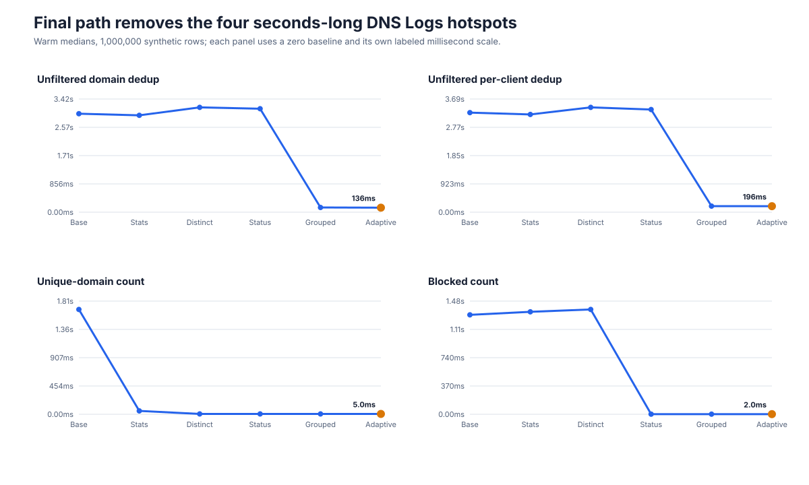

# DNS Logs performance

Technitium DNS Companion is designed to keep stored DNS Logs useful as the
database grows and as individual DNS nodes become slow or unavailable. The
project includes deterministic benchmarks, anonymized deployment measurements,
and reproducible test commands for the database, hostname-enrichment, and
browser request paths.

> **Version context:** Throughout this overview and the linked reports,
> **Before** means the behavior shipped in Companion v1.10.1 (and earlier
> releases using the same implementation). **After** means the optimized
> implementation released in Companion v1.11.0. Named intermediate stages are
> benchmark iterations between those two released versions.

## Results at a glance

On a deterministic database containing 1,000,000 query-log rows, the final
adaptive SQLite path produced these warm median results:

| Stored DNS Logs operation | v1.10.1 baseline | v1.11.0 | Reduction |
| --- | ---: | ---: | ---: |
| Unfiltered domain deduplication | 2,980 ms | 136 ms | 95.4% |
| Unfiltered per-client deduplication | 3,250 ms | 196 ms | 94.0% |
| Unique-domain count | 1,680 ms | 5 ms | 99.7% |
| Blocked-entry count | 1,300 ms | 2 ms | 99.8% |
| Ordinary page one, deduplication off | 0.03 ms | 0.03 ms | No change |

The benchmark reuses an identical deterministic snapshot at every stage. The
dataset spans 36 hours, 5,000 domains, 8 clients, and 3 generic DNS nodes. See
the [SQLite benchmark report](./QUERY_LOG_SQLITE_BENCHMARKS.md) for the complete
method, filtered-query results, raw CSV, and reproduction commands.

## What changes for operators

### Stored pages do not wait on live DHCP nodes

Stored browsing enriches client names from data persisted during ingestion and
from in-memory DHCP/PTR caches. It makes **zero live Technitium node calls** for
hostname enrichment. Previously, an unavailable node without active DHCP scopes
could hold a stored page until the 30-second backend timeout while the browser
gave up after 25 seconds.

In the controlled capability benchmark, lease-refresh latency fell from
80.91 ms to 11.18 ms and lease calls fell from three to one. The important
reliability boundary is stronger than that timing result: stored pages no longer
depend on current node reachability for hostname enrichment.

Read the [DHCP capability and stored-log isolation report](./DHCP_HOSTNAME_ENRICHMENT_BENCHMARKS.md)
for the controlled method, anonymized deployment observations, and raw results.

### Rapid interactions create less abandoned work

DNS Logs requests bypass the PWA runtime cache so browser cancellation reaches
the network path. Paginated navigation is serialized while a request is active,
and automatic refresh pauses when entering Paginated mode.

Controlled tests removed all ten modeled cancelled requests that previously
continued through the service worker, admitted one request instead of five
rapid page selections, and produced no automatic refreshes during a 30-second
paginated dwell.

In production-derived captures of the v1.10.1 behavior and the v1.11.0
implementation, completed backend requests fell from 25.5 to 7.8 per minute, a
69.5% reduction. Ten exact query URLs shared by both captures had a nearly flat
median, while p90 and maximum latency fell by 31.0% and 36.5%. This supports a
reduction in request pile-up and tail latency; it is not presented as a median
SQL speedup.

Read the [browser request-control report](./DNS_LOGS_BROWSER_REQUEST_BENCHMARKS.md)
for the controlled interaction tests, secret-safe HAR analysis, raw aggregates,
and validation boundary.

## Measurement boundaries and trade-offs

- Absolute timings depend on CPU, storage, cache warmth, retention, traffic
  distribution, filters, and page size. Relative changes on the same snapshot
  are the useful comparison.
- The SQLite benchmark excludes hostname enrichment, JSON handling, HTTP
  serialization, browser rendering, and the stored-response cache.
- A rare no-match substring search with deduplication disabled still takes
  approximately 1.3–1.5 seconds at one million rows.
- The two new SQLite indexes added approximately 59.5 MiB per million rows in
  the benchmark. Existing databases build them synchronously during
  startup; that one-time duration varies with database size and storage.
- The production browser captures differed in duration and request population.
  Request rates are normalized, and only matching exact query URLs are used for
  the closer latency comparison.

## Help validate the results

Beta feedback is most useful when it includes the Companion version and build
revision, Technitium version, approximate stored-row count, retention window,
storage type, page size, deduplication mode, filters used, and the operation that
felt slow. Do not include query contents, private addresses, credentials,
cookies, or private hostnames.

See the [Beta Testing Guide](../BETA_TESTING.md) for installation, rollback, and
reporting guidance.
